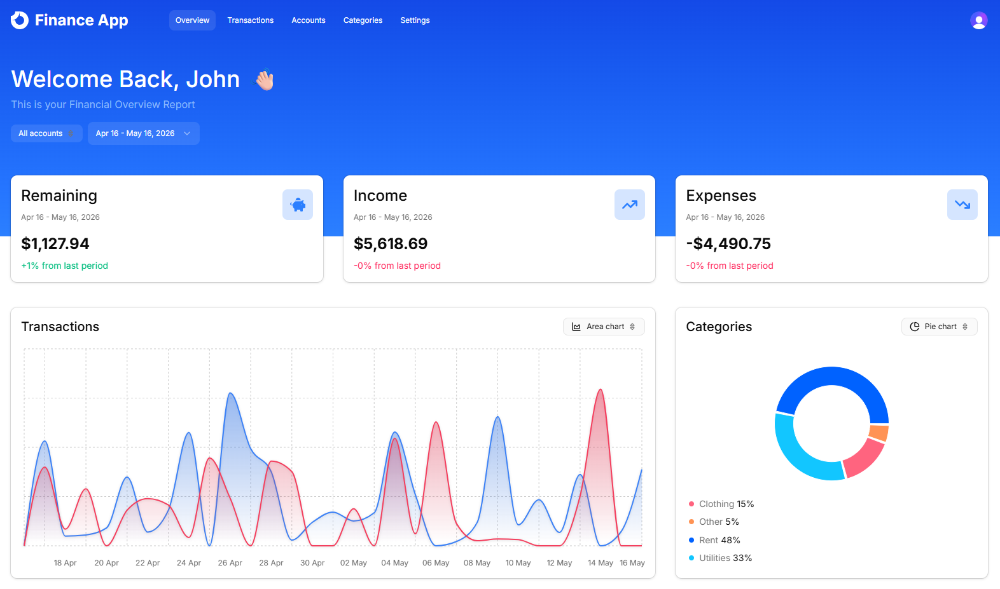
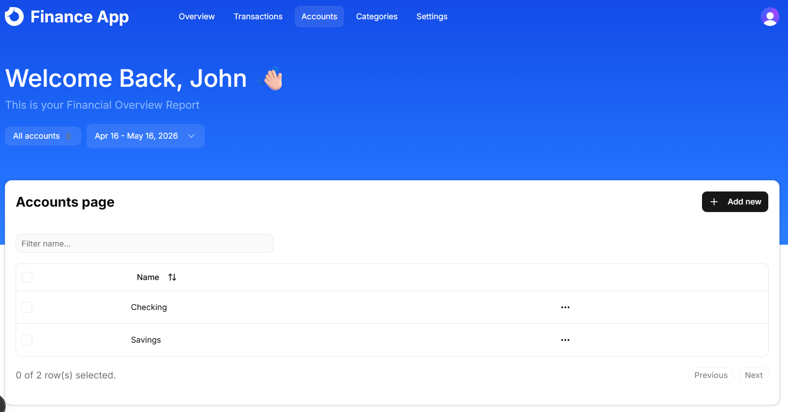
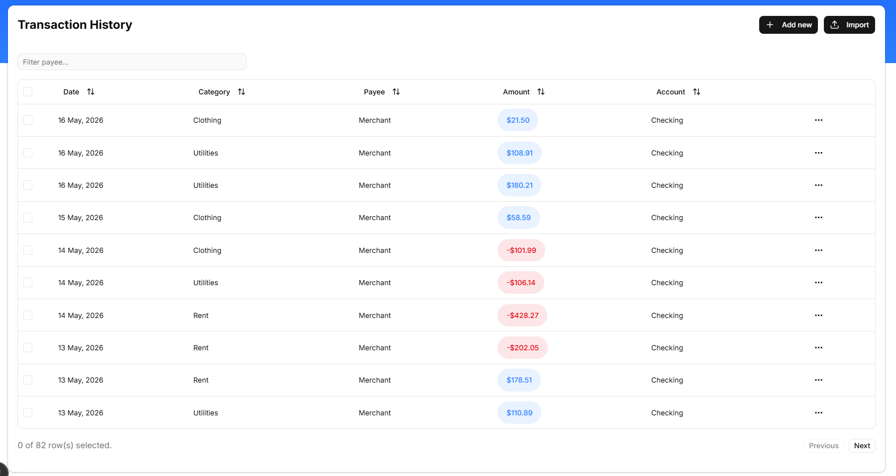
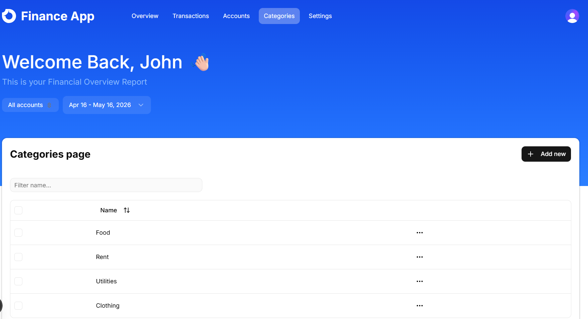

#  Finance App


[https://finance-saas-demo.vercel.app](https://finance-saas-demo.vercel.app/)

A comprehensive, full-stack Finance SaaS application designed to help users track expenses, manage budgets, and analyze their financial health through an intuitive and modern dashboard. Built with the latest web technologies, it offers a seamless experience with robust performance.

---

## 📸 Project Previews

### Dashboard View

The main hub for financial analytics, displaying income, expenses, and interactive charts for categorical breakdowns.


### Accounts Hub

Manage multiple financial accounts (e.g., Checking, Savings, Credit Cards) in one place.


### Transactions Management

A detailed table view of all financial transactions with sorting, filtering, and bulk operations.


### Categories Setup

Organize your expenses with custom categories, enabling granular budget tracking.


---

## 🛠️ Tech Stack

**Frontend:**

-  [Next.js 16](https://nextjs.org/) (App Router)
-  [React 19](https://react.dev/)
-  [Tailwind CSS 4](https://tailwindcss.com/)
-  [Shadcn UI](https://ui.shadcn.com/)
- 📊 [Recharts](https://recharts.org/)
-  [Lucide Icons](https://lucide.dev/)

**Backend & Database:**

-  [Hono.js](https://hono.dev/)
-  [Drizzle ORM](https://orm.drizzle.team/)
-  [Neon Serverless Postgres](https://neon.tech/)

**State Management & Data Fetching:**

-  [TanStack React Query](https://tanstack.com/query/latest)
- 🐻 [Zustand](https://zustand-demo.pmnd.rs/)

**Authentication:**

-  [Clerk](https://clerk.com/)

---

## ✨ Key Features

- **Interactive Dashboard:** Visualizations for financial data using Recharts, giving users an immediate overview of their financial status.
- **Account & Transaction Management:** Full CRUD operations for accounts, categories, and transactions.
- **CSV Import:** Bulk import financial transactions via CSV, mapped seamlessly into the system.
- **Secure Authentication:** User authentication and authorization powered by Clerk.
- **API First Approach:** Robust and scalable API built with Hono.js, making the backend logic lightweight and edge-ready.
- **Type-Safe Database:** Using Drizzle ORM and Neon (Serverless Postgres) for secure, type-safe, and highly scalable database operations.
- **State Management:** Utilizing React Query for server state management and caching, alongside Zustand for client-side state.
- **Modern UI/UX:** Built with Tailwind CSS, Shadcn UI, and Lucide Icons for a beautiful, responsive, and accessible interface.
- **Dark Mode Support:** Fully integrated dark mode using `next-themes`.

---

## 🚀 Getting Started

Follow these steps to set up the project locally on your machine.

### Prerequisites

Make sure you have Node.js and npm/yarn/pnpm installed.

### Installation

1.  **Clone the repository**

    ```bash
    git clone https://github.com/your-username/finance-saas.git
    cd finance-saas
    ```

2.  **Install dependencies**

    ```bash
    npm install
    ```

3.  **Set up environment variables**
    Create a `.env` file in the root directory and add the following keys. (You will need to set up projects in Clerk and Neon to get these keys).

    ```env
    NEXT_PUBLIC_CLERK_PUBLISHABLE_KEY=your_clerk_publishable_key
    CLERK_SECRET_KEY=your_clerk_secret_key
    NEXT_PUBLIC_CLERK_SIGN_IN_URL=/sign-in
    NEXT_PUBLIC_CLERK_SIGN_UP_URL=/sign-up

    DATABASE_URL=your_neon_database_url
    ```

4.  **Run database migrations**

    ```bash
    npm run db:generate
    npm run db:migrate
    ```

5.  **Seed the database (Optional)**
    Populate the database with initial dummy data to easily test out the application features.

    ```bash
    npm run db:seed
    ```

6.  **Start the development server**

    ```bash
    npm run dev
    ```

7.  Open [http://localhost:3000](http://localhost:3000) in your browser to view the application.

---
